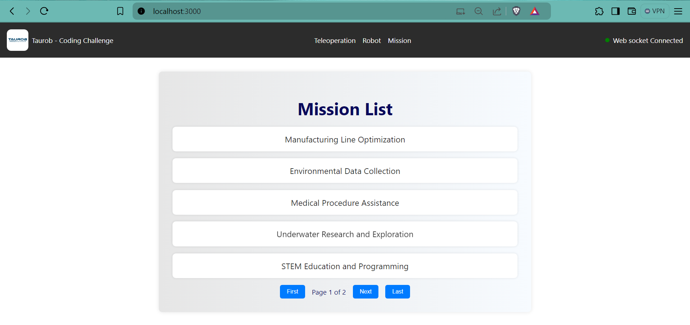
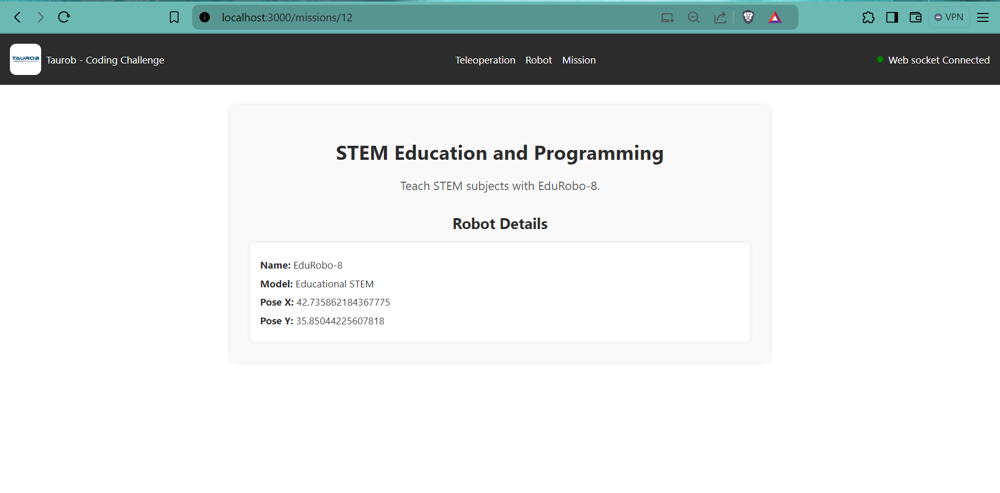
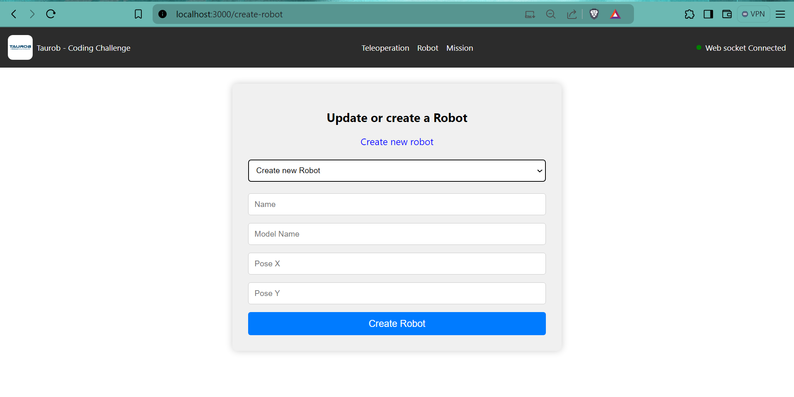
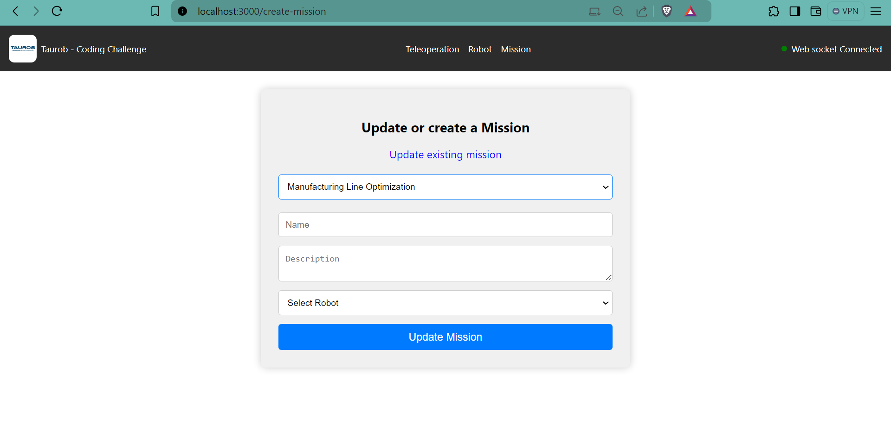
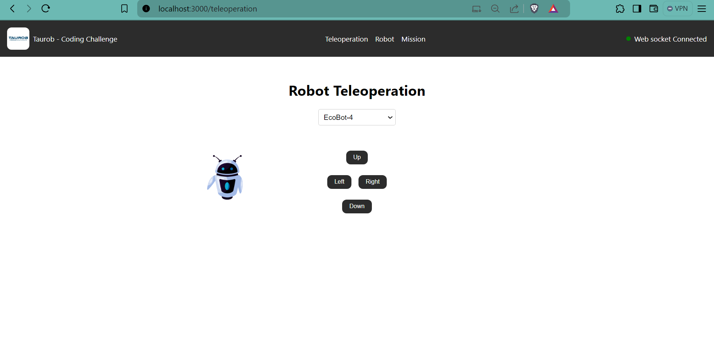
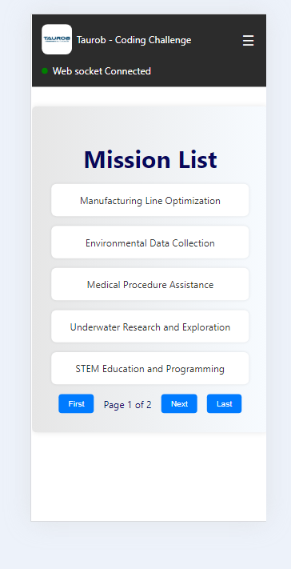

# Getting Started with Create React App

This project was bootstrapped with [Create React App](https://github.com/facebook/create-react-app).

## Part 1: Installation and Setup

### Available Scripts

In the project directory, you can run:

#### `npm install`

Installs all the dependencies required for the project.

#### `npm start`

Runs the app in the development mode.\
Open [http://localhost:3000](http://localhost:3000) to view it in your browser.

The page will reload when you make changes.\

## Part 2: Screenshots and Description

### Home Screen (MissionList)

The home screen displays a list of missions. Each mission is clickable and navigates to the mission details page.

### Mission Details Screen (MissionDetails)

This screen shows the details of a selected mission, including the associated robot's details.

### Robot Form Screen (RobotForm)

This screen allows users to create or update a robot. It includes fields for the robot's name, model name, and pose coordinates.

### Mission Form Screen (MissionForm)

This screen allows users to create or update a mission. It includes fields for the mission's name, description, and associated robot.

### Robot Teleoperation Screen (RobotTeleoperation)

This screen allows users to control a robot's movements. Users can select a robot and use directional buttons to move it.

Mobile screen 
